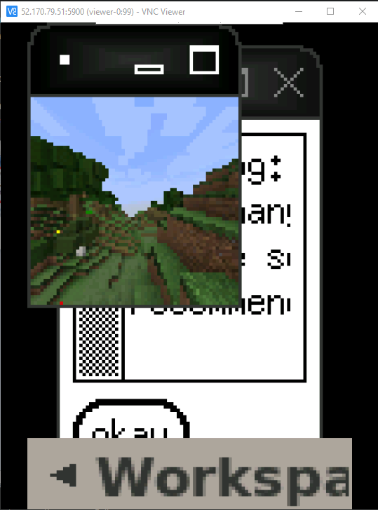

# rl-hypothesis-2

Goal: Apply meta-learning to MineRL, producing a few-shot learning base-line. Implement with distributed computing, shortening time spent on experiments. Use base-line and fast experiments to study one-shot learning approaches. 

## configure

Copy `rl-hypothesis-2-config.sh` to `$HOME` and enter values. 

## steup

```
bash build.sh --phase-2
```

## clean up

```
bash build.sh --clean-up
```

## architecture 


## interactive data generation

You can connect to an environment to manually generate data to bootstrap model fitting.
1. To view the environment's screen, download a vnc viewer. One is available [here](https://www.realvnc.com/en/). 
2. To get an IP to connect your vnc client to, run `kubectl get service viewer`. Use the `EXTERNAL-IP`. Use port 5900.
3. To take control, run `kubectl exec -it viewer-0 -- tmux attach -t tmux-session`. It'll prompt you with controls.
4. If you have connectivity trouble, restart the viewer by running `kubectl delete pod viewer-0`. Give it a minute to reboot before reconnecting. 

 


## hardware requirements 

Azure VM node types are listed [here](src/terraform/phase-1/variables.tf). You'll likely need to request increased [quotas](https://docs.microsoft.com/en-us/azure/azure-portal/supportability/per-vm-quota-requests) for these node types:
- `NC6s v2` (GPUs)
- `A2M v2`

