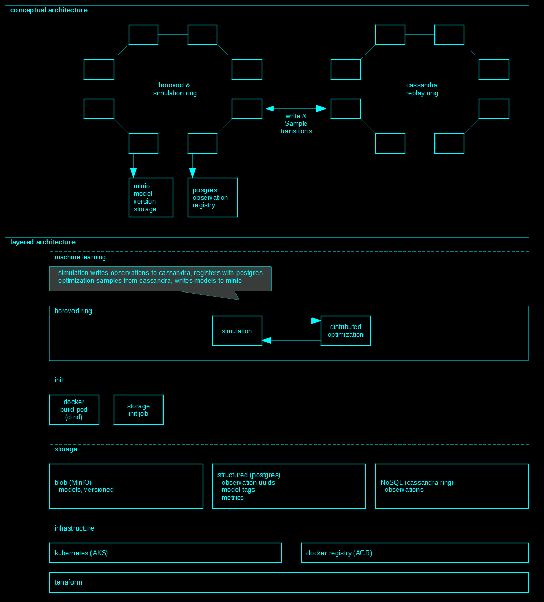

# rl-hypothesis-2

Goal: Apply meta-learning to MineRL, producing a few-shot learning base-line. Implement with distributed computing, shortening time spent on experiments. Use base-line and fast experiments to study one-shot learning approaches. 

## configure

Copy `rl-hypothesis-2-config.sh` to `$HOME` and enter values. 

## steup

```
bash build.sh --phase-2
```

## clean up

```
bash build.sh --clean-up
```

## architecture 



## Notes

- Wondering why `terraform/` and `helm/` are in `src/`?  Given the maturity of *infrastructure-as-code*, I see no reason burden myself with separating my *dev* and *ops*. For me, *intrstructure-is-code*. 
- Special thanks to [`shadowyzy`](https://github.com/shadowyzy) for posting MineRL deep learning code, available [here](https://github.com/shadowyzy/NIPS2019-MineRL-Competition-solution). This code served as my initial model design. Discovering decent model code is very time consuming, so has accelerated my work. 

